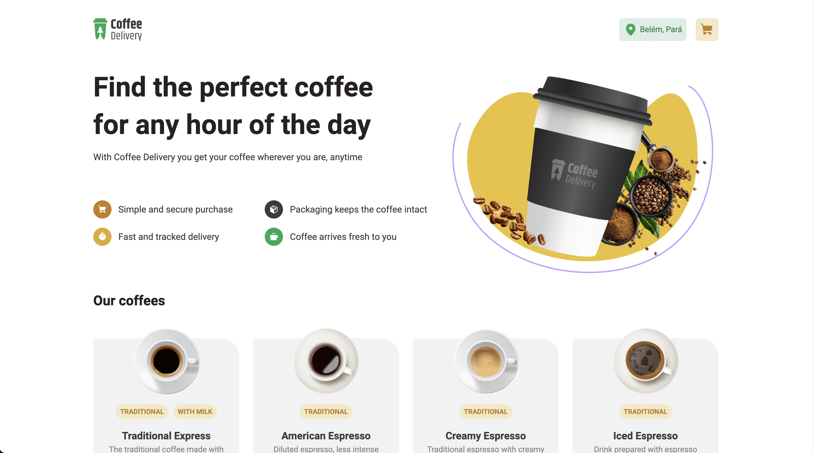

# CoffeLivery ☕️

Coffelivery is your favorite online coffee store made with Next.js, TailwindCSS and Hygraph CMS ⚛️


# Proposal 🔥

<p align="center" t>
  
</p>

Live demo: https://coffeelivery-prqt7d4xf-andrecampll.vercel.app

# Outcomes 🚀

- This project was made to approach and practice advanced React concepts like reducers and Context API to handle the global state management.

- TailwindCSS that builds up the entire application styles.

- SSR and SSG with Next.js to increase performance by rendering pages on server side (SSR) and static content (SSG).

- There's an advanced React Hook that handles the integration with the Nominatim API in order to do the geolocalization feature.

- An awesome integration with React Hook Form that handles the forms state management.

- Great GraphQL integration with Apollo Client to fetch products with GraphQL and CodeGen to automatically generate GraphQL's types.

- Hygraph connection to provide all necessary product related data.

# Technologies 🚀
Next.js ⚛️ <br />
GraphQL ⚛️ <br />
CodeGen ⚛️ <br />
Apollo Client⚛️ <br />
Hygraph ⚡️ <br />
TailwindCSS 💅 <br />
Typescript 🦕 <br />

# Getting Started 🤔
```bash
# Create a .env file by following the .env.example file.
# Tip: you can use the same API url in the example.

# Run the `gen` command to build up Codegen
$ yarn gen
# Tip: this must be done every time an query/mutation changes

# Start the project by running `dev` command
$ yarn dev

# Open your browser on `localhost:3000`
```

# How to contribute? 😍
**Fork this repository**
```bash
# Clone your fork
$ git clone your-fork-url && cd coffelivery

# Create a branch with your feature or bug fix
$ git checkout -b my-branch

# Commit your changes
$ git commit -m 'my changes'

# Push your branch
$ git push origin my-branch
```

Delete your branch, if you want, when your pull request merge. <br />

Made with 💜 by <a href="https://www.linkedin.com/in/andrecampll/" target="_blank"> andrecampll </a>. <br />
<br />
